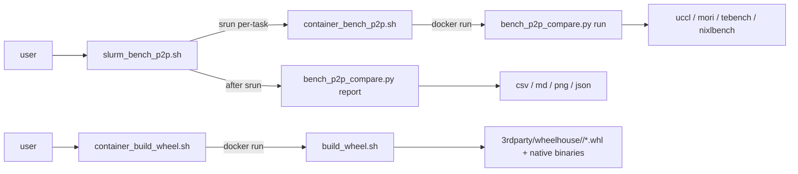

# BenchP2P

BenchP2P provides a unified harness for comparing point-to-point bandwidth and
latency across common P2P stacks:

- MORI: `https://github.com/ROCm/mori.git`
- Mooncake: `https://github.com/kvcache-ai/Mooncake.git`
- UCCL: `https://github.com/uccl-project/uccl.git`
- NIXL: `https://github.com/ai-dynamo/nixl.git`

The harness clones these public repositories into `3rdparty/`, builds Python
wheels and native benchmark binaries inside `docker.io/rocm/primus:v26.2`,
runs each backend's *official* benchmark, and emits:

- `p2p_results.csv`: per-size measurements
- `p2p_summary.csv`: best bandwidth and best latency per backend
- `p2p_results.md`: Markdown table
- `p2p_metrics.json`: parsed metrics
- `p2p_comparison.png`: bandwidth and latency chart
- `logs/`: raw backend logs (one file per backend per rank)

## Layout

```
scripts/
  build_wheel.sh             # shell: per-backend build (wheel + native binaries)
  container_build_wheel.sh   # docker run + build_wheel.sh inside the runtime image
  bench_p2p_compare.py       # `run` (per-rank, in container) + `report` (host-side aggregator)
  container_bench_p2p.sh     # docker run + bench_p2p_compare.py
  slurm_bench_p2p.sh         # srun N tasks of container_bench_p2p.sh + report on host
```



## Official benchmark mapping

BenchP2P keeps the workload comparable by using the same message sizes,
operation (`--op-type read|write`), batch size (`--num-blocks` or the matching
backend batch flag), one initiator device, and one target device.

| Backend | Official benchmark entry | Native metrics parsed |
| --- | --- | --- |
| UCCL | `3rdparty/uccl/p2p/benchmarks/benchmark_uccl.py` | log lines with `GB/s` and latency |
| MORI | `3rdparty/mori/tests/python/io/benchmark.py` | MORI table: `Avg Bw (GB/s)`, `Avg Lat (us)` |
| Mooncake | official `tebench` from `mooncake-transfer-engine/benchmark` | `BW (GB/S)`, `Avg Lat (us)` |
| NIXL | official `nixlbench` from `nixl/benchmark/nixlbench` | `B/W (GB/Sec)`, `Avg Lat. (us)` |

NIXLBench uses ETCD for multi-process coordination. By default rank 0 starts a
local ETCD server (looked up from `PATH`) and both ranks connect to
`http://MASTER_ADDR:2379`. Use `--no-nixl-start-etcd --nixl-etcd-endpoints
<url>` when ETCD is provided externally. Mooncake uses `tebench` in
TENT/RDMA mode by default; pass `--mooncake-bench-bin <path>` if the binary
is not on `PATH`.

For MORI's RDMA backend the harness automatically resolves `MASTER_ADDR`
(hostname) to its IPv4 via `socket.getaddrinfo` before passing it as `--host`,
because mori's TCP bootstrap can hit `Network is unreachable` on clusters
where the bare hostname has no direct route. Other backends keep using
`MASTER_ADDR` untouched.

## Build the wheelhouse

The default and recommended path is to build everything inside
`docker.io/rocm/primus:v26.2`:

```bash
bash scripts/container_build_wheel.sh
```

That wraps `build_wheel.sh` with the standard ROCm/RDMA `docker run` flags,
mounts the repo, and writes wheels under `3rdparty/wheelhouse/<backend>/`.

`build_wheel.sh` does **not** just call `pip install`; it dispatches per
backend to that project's own install/build flow:

| Backend | Build path used |
| --- | --- |
| **mori** | `pip wheel <repo>` (mori is Python-only; no separate native binary) |
| **uccl** | `make -j -f p2p/Makefile.rocm` (mirrors `uccl/build_inner.sh build_p2p`), stages `libuccl_p2p.so` and `p2p.*.so` into the `uccl/` package dir, renames cpython-tagged ABI to `.abi3.so` on Python>=3.12, then `pip wheel` |
| **mooncake** | `Mooncake/dependencies.sh -y` (apt + Go + yalantinglibs) -> `cmake -B build -DUSE_HIP=ON -DWITH_TE=ON ...` -> `ninja` (produces `engine.so` + `tebench`) -> official `Mooncake/scripts/build_wheel.sh` (auditwheel-repaired wheel with binaries embedded) |
| **nixl** | `meson setup nixl/build --prefix=<nixl-prefix>` + `ninja install` -> `meson setup benchmark/nixlbench/build -Dnixl_path=<nixl-prefix>` + `ninja` -> `pip wheel nixl` |

Useful flags (forwarded to `build_wheel.sh` after `--`):

```bash
bash scripts/container_build_wheel.sh -- --backends mori,uccl
bash scripts/container_build_wheel.sh -- --skip-clone --no-clean
bash scripts/container_build_wheel.sh --pull -- --backends nixl --timeout 7200
bash scripts/container_build_wheel.sh -- --skip-binaries        # python wheels only
bash scripts/container_build_wheel.sh -- --skip-apt-deps        # skip Mooncake's apt step
bash scripts/container_build_wheel.sh -- --jobs 32 --continue-on-error
bash scripts/container_build_wheel.sh -- --nixl-prefix /opt/nixl-1.1
```

To build directly on the host (for local development) skip the container:

```bash
bash scripts/build_wheel.sh                         # all backends
bash scripts/build_wheel.sh --backends mooncake     # one backend
bash scripts/build_wheel.sh --dry-run --skip-clone  # preview commands
```

`build_wheel.sh` requires `jq`, `git`, `python3 + pip`, `cmake`, `ninja`,
`make`, and `hipcc` on `PATH` (the rocm/primus image provides them all).
For `mooncake` it also needs the apt deps installed by `dependencies.sh`
(`libgflags-dev`, `libgoogle-glog-dev`, `libjsoncpp-dev`, `libgrpc++-dev`,
...); pass `--skip-apt-deps` if your container is already provisioned. For
`nixl` it additionally needs `meson` and the gRPC/protobuf dev packages.
Inside the runtime container, `build_wheel.sh` writes `safe.directory=*` to
git so bind-mounted host checkouts pass git's ownership check.

## Run the benchmark

The end-to-end path is `slurm -> container -> bench`:

```bash
bash scripts/slurm_bench_p2p.sh \
  --partition amd-rccl --gres gpu:1 --time 00:30:00 \
  --output-dir ~/bp2p-runs/full \
  -- \
  --backends mori,mooncake,uccl,nixl \
  --size-min 256 --size-max 16M \
  --iters 10 \
  --device gpu
```

The wrapper builds an `srun --nodes=2 --ntasks=2 --ntasks-per-node=1` command
that, on each task, derives `MASTER_ADDR / MASTER_PORT / RANK / WORLD_SIZE /
LOCAL_RANK / LOCAL_WORLD_SIZE` and then `exec`s `container_bench_p2p.sh`.
Inside the container, `bench_p2p_compare.py run` installs the wheelhouse,
then runs each requested backend; logs land in
`<output-dir>/logs/<backend>_rank<N>.log`. After `srun` returns, the wrapper
runs `bench_p2p_compare.py report --output-dir <dir>` on the submission host
to write the summary CSV/Markdown/PNG/JSON. The `report` step uses
matplotlib (already available in `rocm/primus:v26.2`; on bare hosts run
`pip install matplotlib` once).

> Use a shared FS (`$HOME` over NFS, or a project filesystem) for
> `--output-dir`. Do **not** use `/tmp/...`: that path is local to each
> compute node and the post-srun `report` step on the login node will not
> see the per-rank logs.

### Message-size selection

Two equivalent ways to pick sizes:

```bash
# Explicit list (default behaviour, matches the old --sizes flag)
... -- --sizes 256,1K,4K,64K,1M,16M,100M ...

# ib_write_bw -a style power-of-two sweep (overrides --sizes)
... -- --size-min 256 --size-max 16M             # doubling, 17 sizes
... -- --size-min 1K  --size-max 64M --size-step-factor 4   # x4 between sizes
```

`--size-min` / `--size-max` accept human-readable suffixes (`64`, `1K`, `256K`,
`1M`, ...) and require both ends. The harness pre-expands the sweep, then
each backend's loop iterates one size per invocation.

### Other common variations

```bash
bash scripts/slurm_bench_p2p.sh --standalone-allocation \
  --partition amd-rccl --gres gpu:1 --time 00:30:00 \
  -- --backends mori,uccl --size-min 256 --size-max 512M --iters 50 --ib-hca mlx5_0

# parse logs collected elsewhere
python3 scripts/bench_p2p_compare.py report \
  --output-dir ~/bp2p-runs/full \
  --from-log mori=/path/to/extra_mori.log
```

`slurm_bench_p2p.sh` forwards standard slurm selectors (`--partition`,
`--account`, `--qos`, `--time`, `--constraint`, `--gres`, `--gpus-per-task`,
`--cpus-per-task`, `--job-name`) and accepts `--extra-srun-args` for
site-specific additions. Container-level flags (`--image`, `--docker-bin`,
`--container-python`, `--pull`, `--mount-home`, `--extra-mount`,
`--extra-docker-args`) are forwarded to `container_bench_p2p.sh`. Use
`--standalone-allocation` to make srun ignore the surrounding
salloc/sbatch and request a fresh allocation matching `--nodes / --ntasks`
(implemented via `env -u SLURM_JOB_ID -u SLURM_NODELIST ...`).

## Generated docker invocation

`container_build_wheel.sh` and `container_bench_p2p.sh` both follow the
ROCm/RDMA pattern:

```
docker run --rm --ipc=host --network=host \
  --device=/dev/kfd --device=/dev/dri --device=/dev/infiniband \
  --cap-add=SYS_PTRACE --cap-add=CAP_SYS_ADMIN \
  --security-opt seccomp=unconfined --group-add video --privileged \
  --workdir <repo> -v <repo>:<repo> [...] <image> bash -lc <inner-cmd>
```

`container_bench_p2p.sh` additionally `--env`-passes
`MASTER_ADDR / MASTER_PORT / RANK / WORLD_SIZE / LOCAL_RANK /
LOCAL_WORLD_SIZE / SLURM_*`, and auto-mounts any `--output-dir`,
`--source-root`, `--wheelhouse`, or `--manifest` path that lives outside the
repo so the artifacts survive container teardown.

## Notes

- All entry points support `--help`. `--dry-run` prints commands without
  executing them; the slurm wrapper additionally prints the post-srun
  `report` command for inspection.
- Rank 0 acts as server/initiator and rank 1 acts as client/target where the
  backend needs explicit roles (mooncake `tebench`, nixl `nixlbench`).
- MORI defaults to `--mori-backend rdma` with two ranks. Use
  `--mori-backend xgmi` for single-node GPU-to-GPU XGMI testing.
- MORI's `benchmark.py` requires integer-byte `--buffer-size`; the harness
  converts every sweep size with `parse_size()` before passing it through, so
  `--sizes 1K,1M,...` and `--size-min 1K --size-max 1M` work transparently.
- MORI's published IO examples often use batched transfers; this harness
  defaults to `--mori-transfer-batch-size 1` for a per-transfer comparison.
  Set it to `128` if you want to mirror that MORI benchmark style.
