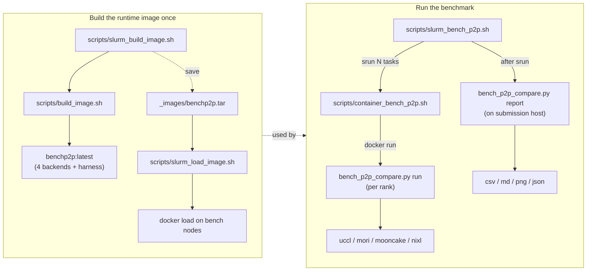

# BenchP2P

Unified harness for comparing point-to-point bandwidth and latency across
four common P2P stacks, all running each backend's **official** benchmark
inside the same container so the numbers are apples-to-apples:

- **MORI**: <https://github.com/ROCm/mori.git>
- **Mooncake**: <https://github.com/kvcache-ai/Mooncake.git>
- **UCCL**: <https://github.com/uccl-project/uccl.git>
- **NIXL**: <https://github.com/ai-dynamo/nixl.git>

A run produces, under `--output-dir`:

| File | Content |
| --- | --- |
| `logs/<backend>_rank<N>.log` | Raw stdout/stderr from each backend invocation |
| `p2p_results.csv` | Per-(backend, size, batch) measurement |
| `p2p_summary.csv` | Best bandwidth + best latency per backend |
| `p2p_results.md` | Markdown table for PR / report |
| `p2p_metrics.json` | Same data, JSON |
| `p2p_comparison.png` | Bandwidth + latency chart (matplotlib) |

---

## Layout



```text
scripts/
  build_image.sh         # docker build of ./Dockerfile  -> benchp2p:latest
  slurm_build_image.sh   # srun a fat node to run build_image.sh, optional --save-image tar
  slurm_load_image.sh    # srun docker load on every bench node
  bench_p2p_compare.py   # `run` (per rank) + `report` (host aggregator)
  container_bench_p2p.sh # docker run + bench_p2p_compare.py
  slurm_bench_p2p.sh     # srun N tasks + bench, then host-side report
  backend/run_<name>.sh  # per-rank wrapper that invokes each backend's official benchmark
```

Every entry point accepts `--help` and `--dry-run`. Site-specific helpers
(`switch_apt_mirror.sh`, `build_wheel.sh`, `container_build_wheel.sh`) are
kept for offline / GFW clusters and dev iteration; see their header
comments.

---

## Build

Bake all four backends + the harness into one `benchp2p:latest` image so a
bench run is just `docker run benchp2p:latest bench_p2p_compare run ...`,
no per-run pip install.

```bash
# 0) populate submodules (Dockerfile builds with --skip-clone)
git submodule update --init --recursive

# 1a) Build directly on the current host
bash scripts/build_image.sh

# 1b) Build on a Slurm fat node and save a tar onto shared FS
bash scripts/slurm_build_image.sh \
  --nodelist useocpm2m-097-132 --time 02:00:00 --cpus-per-task 64 \
  --save-image _images/benchp2p.tar

# 2) Distribute the tar to every bench node (skip if you have a registry)
bash scripts/slurm_load_image.sh \
  --nodelist 'useocpm2m-097-[132,135]' --nodes 2
```

Build args (forward to `docker build` via `--build-arg`):

| Arg | Default | Purpose |
| --- | --- | --- |
| `BACKENDS` | `mori,mooncake,uccl,nixl` | Subset of backends to build |
| `JOBS` | `$(nproc)` | make/ninja parallelism |
| `APT_PRESET` / `APT_MIRROR` | — | Switch APT inside the build container (e.g. `--apt-preset aliyun` for GFW clusters) |
| `PIP_INDEX_URL` | — | Override pip index for the wheel install layer |

---

## Bench

End-to-end Slurm command. The wrapper `srun`s 2 tasks (rank 0 = initiator,
rank 1 = target), each `exec`s `container_bench_p2p.sh` which `docker run`s
`bench_p2p_compare.py run`. After `srun` returns, the wrapper invokes
`bench_p2p_compare.py report` on the submission host to aggregate logs.

```bash
bash scripts/slurm_bench_p2p.sh \
  --partition amd-rccl --gres gpu:1 --time 00:30:00 \
  -- \
  --backends mori,mooncake,uccl,nixl \
  --op-type write \
  --size-min 8 --size-max 16M \
  --batch-size 128 \
  --iters 100 \
  --async-api \
  --ib-hca mlx5_0,mlx5_2,mlx5_3,mlx5_4,mlx5_5,mlx5_7,mlx5_8,mlx5_9 \
  --device gpu
```

Use a **shared FS** for `--output-dir` (defaults to
`<repo>/results/p2p_compare_<ts>`). Do NOT use `/tmp/...`: that is local to
each compute node, and the post-srun `report` step on the login node will
not see the per-rank logs.

### Core bench flags

| Flag | Default | Effect |
| --- | --- | --- |
| `--backends` | `mori,mooncake,uccl,nixl` | Subset to run |
| `--op-type {read,write}` | `write` | RDMA op for **all four backends** (see ULP table below) |
| `--sizes 256,1K,1M,...` *or* `--size-min/--size-max [--size-step-factor F]` | 256B–100MB list | Either explicit list (with `K/M/G` suffixes) or `ib_write_bw -a` style power-of-`F` sweep (default `F=2`) |
| `--batch-size N` | `1` | Unified batch flag fanned out per backend (alias `--num-blocks`) |
| `--iters N` | `10` | Iterations per size; bump to 100+ for stable small-size numbers |
| `--async-api` | off | Use each backend's async path (recommended for peak-BW measurement) |
| `--device {gpu,cpu}` | `gpu` | Buffer location |
| `--ib-hca SPEC` | unset | NCCL-style HCA selector: `"a,b,c"` whitelist or `"^a,b"` exclude (UCCL is auto-clamped to 4 NICs by `run_uccl.sh` due to UCCL's compile-time `kNICContextNumber=4`) |

### `--op-type write` ⇒ everyone runs RDMA WRITE

| Backend | Native invocation under `--op-type write` |
| --- | --- |
| **mooncake** | `transfer_engine_bench --operation write` |
| **nixl** | `nixlbench --op_type WRITE` |
| **mori** | `benchmark.py --op-type write` |
| **uccl** | `benchmark_uccl_readwrite.py --mode write --lazy` (one-sided RDMA WRITE) |

UCCL-specific escape hatches (rarely needed):

- `--uccl-sendrecv` → use the legacy two-sided `benchmark_uccl.py` (RDMA SEND/RECV). Only useful when comparing UCCL's own SEND/RECV vs WRITE cost — **not** for cross-backend comparison.
- `--uccl-no-lazy` → disable `benchmark_uccl_readwrite.py --lazy` (per-iter `ibv_reg_mr`).

### `--batch-size N` fans out per backend

| Backend | Native flag |
| --- | --- |
| UCCL | `--num-iovs N` (or `--num-kvblocks` under `--uccl-sendrecv`) |
| MORI | `--transfer-batch-size N` (auto-adds `--enable-batch-transfer --enable-sess` when `N > 1`) |
| nixlbench | `--start_batch_size N --max_batch_size N` |
| Mooncake | `transfer_engine_bench --batch_size N` |

### Report only (re-aggregate logs)

```bash
python3 scripts/bench_p2p_compare.py report --output-dir <existing run dir>

# pull in extra logs from other runs into the same report
python3 scripts/bench_p2p_compare.py report \
  --output-dir ~/bp2p-runs/full \
  --from-log mori=/path/to/extra_mori.log
```

---

## Common recipes

```bash
# 1) Cross-backend RDMA WRITE comparison, single NIC, full size sweep
bash scripts/slurm_bench_p2p.sh \
  --partition amd-rccl --gres gpu:1 --time 00:30:00 \
  -- --size-min 256 --size-max 1G \
     --op-type write \
     --batch-size 1 --iters 100 --async-api \
     --ib-hca mlx5_0

# 2) Compare RDMA WRITE vs READ (two runs into different output dirs)
bash scripts/slurm_bench_p2p.sh -- --op-type write --output-dir results/write/
bash scripts/slurm_bench_p2p.sh -- --op-type read  --output-dir results/read/

# 3) Build the image on a fat node, distribute, then run on a different pair
bash scripts/slurm_build_image.sh \
  --nodelist useocpm2m-097-132 --time 02:00:00 --cpus-per-task 64 \
  --save-image _images/benchp2p.tar
bash scripts/slurm_load_image.sh \
  --nodelist 'useocpm2m-097-[132,135]' --nodes 2
bash scripts/slurm_bench_p2p.sh --nodelist 'useocpm2m-097-[132,135]' \
  -- --size-min 256 --size-max 1G --batch-size 1 --async-api
```
